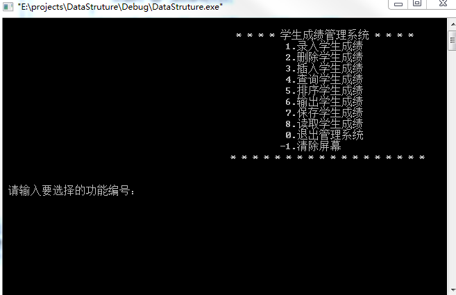
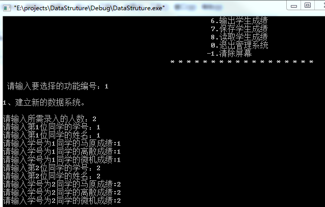
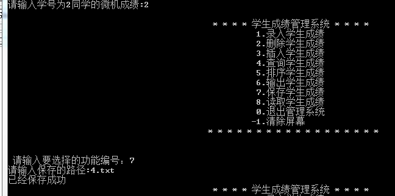
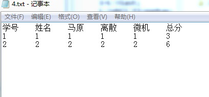

# 学生成绩管理系统（C语言）

    位置：C/学生成绩管理系统

# 学生信息管理系统（C语言链表实现）

    位置：C/学生信息管理系统

    说明：学生(学号,年级,姓名,性别,班级,文理科)信息的增删改查

# 学生成绩管理系统（Python）

    位置：python/学生成绩管理系统

    说明：控制台的增删改查，可以录入任意门课程，存储到文件

# 学生信息管理系统 (python)

    位置：python/学生信息管理系统

    说明：学生信息写死了（学号，姓名，年龄），控制台的增删改查，存储到文件

